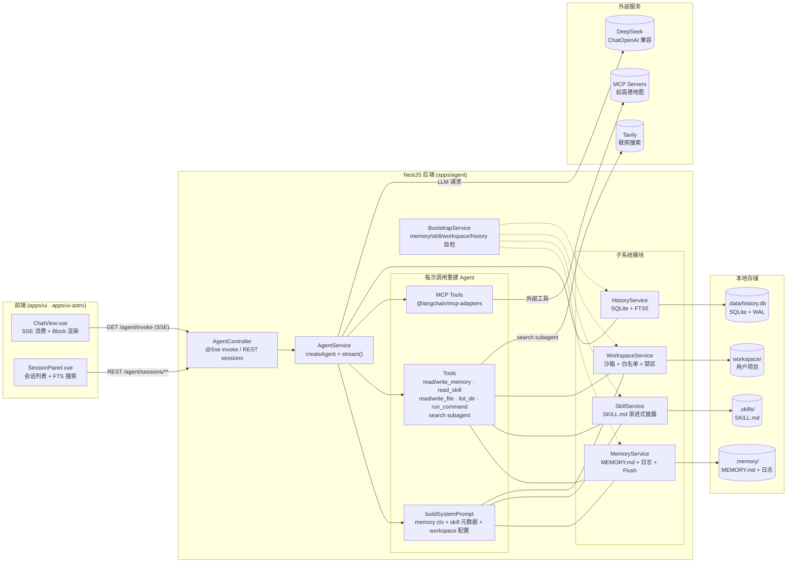
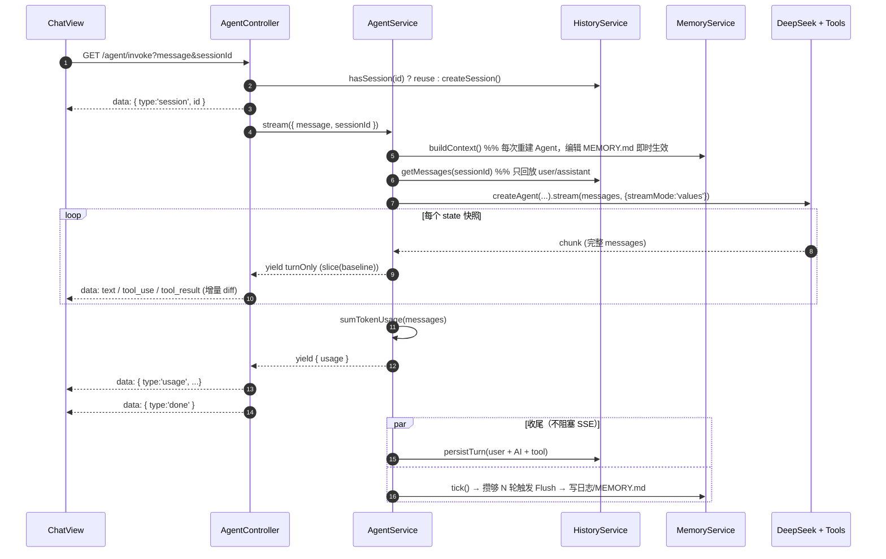

# ai-agent

[](https://github.com/oceanstation/ai-agent/releases)
[](https://nodejs.org)
[](https://opensource.org/licenses/MIT)

一个基于 **NestJS + LangChain + Vue 3** 的可扩展 AI Agent 单体仓库（Nx monorepo）。后端以 DeepSeek 为主模型，内置**长期记忆 / 技能库 / 工作区 / 会话历史 / MCP 工具**五套子系统，通过 SSE 以 **Content Block** 协议向前端流式推送。

## 目录结构

```
ai-agent/
├── apps/
│   ├── agent/         # NestJS 后端（LangChain Agent + REST/SSE）
│   ├── ui/            # Vue 3 + Vite 主前端（ChatView / SessionPanel）
│   └── ui-astro/      # Astro + Vue 岛屿架构的实验前端
├── packages/
│   └── common/        # 前后端共享类型（ContentBlock 等）
├── .memory/           # 运行时长期记忆（MEMORY.md + 按日日志）
├── .skills/           # Skill 库（渐进式披露）
├── .data/             # SQLite 历史库（history.db）
└── workspace/         # Agent 可读写的用户项目根目录
```

技术栈：Nx 23 + pnpm workspace · NestJS 11 · LangChain 1.x（`createAgent` + `summarizationMiddleware`） · `@langchain/openai`（对接 DeepSeek 兼容端点） · `@langchain/mcp-adapters` · `better-sqlite3`（`--experimental-sqlite`） · Vue 3.5 · Astro 5。

## 快速开始

### 1. 安装依赖

包管理器固定为 **pnpm 9.15+**（见 `packageManager`）。

```sh
pnpm install
```

### 2. 配置环境变量

```sh
cp .env.example .env
# 至少填写 DEEPSEEK_API_KEY，其余项都有内置默认值
```

关键变量速查：

| 分组 | 变量 | 说明 |
|---|---|---|
| 服务 | `PORT` | NestJS 端口，默认 `3000` |
| LLM | `DEEPSEEK_API_KEY` / `DEEPSEEK_API_URL` / `DEEPSEEK_MODEL` | 主模型 & Memory Flush 摘要模型 |
| 搜索 | `TAVILY_API_KEY` | 联网搜索工具（可选） |
| MCP | `AMAP_MCP_KEY` | 高德地图 MCP（可选） |
| 历史 | `HISTORY_DB_PATH` | SQLite 路径，默认 `.data/history.db` |
| 记忆 | `MEMORY_ROOT` / `MEMORY_RECENT_DAYS` / `MEMORY_FLUSH_*` | 长期记忆根目录、日志窗口、Flush 策略 |
| 技能 | `SKILLS_ROOT` | Skill 根目录，默认 `skills` |
| 工作区 | `WORKSPACE_ROOT` / `WORKSPACE_WRITABLE` / `WORKSPACE_COMMAND_ENABLED` / `WORKSPACE_COMMAND_ALLOWLIST` | Agent 可访问的用户项目目录 & 权限 |

**默认策略：最小权限** —— `WORKSPACE_WRITABLE=false`、`WORKSPACE_COMMAND_ENABLED=false`，`run_command` 走白名单（默认仅 `ls,cat`）。

### 3. 一键启动开发环境

```sh
pnpm dev            # 并行拉起 agent + ui
```

或单独启动：

```sh
pnpm agent:serve    # 仅后端（http://localhost:3000）
pnpm ui:dev         # 仅 Vue 前端（http://localhost:4200）
pnpm ui-astro:dev   # 实验性 Astro 前端
```

> ⚠️ 后端 `serve` 通过 `runtimeArgs: ['--experimental-sqlite']` 启动 Node，依赖 Node ≥ 22.5 内置的实验性 SQLite。

### 4. 生产构建

```sh
pnpm build                       # 构建 agent + ui
pnpm nx run @ai-agent/agent:prune  # 生成可独立部署的 dist（含 pnpm-lock 剪裁）
```

## 架构总览

### 系统架构



### 单次对话时序（SSE Content Block）



## 后端能力概览

### API 端点（`apps/agent/src/app/agent/agent.controller.ts`）

| Method | Path | 说明 |
|---|---|---|
| `GET` | `/agent/invoke?message=...&sessionId=...` | **SSE 流式对话入口**，逐块下发 ContentBlock |
| `POST` | `/agent/sessions` | 新建空会话，返回 `HistorySession` |
| `GET` | `/agent/sessions?limit=100` | 会话列表（按活跃时间倒序） |
| `GET` | `/agent/sessions/:id/messages` | 会话完整消息 |
| `GET` | `/agent/sessions/:id/search?q=...` | 单会话内 SQLite **FTS5 全文检索**，返回 `<mark>` 高亮片段 |
| `DELETE` | `/agent/sessions/:id` | 删除会话及其消息 |

### SSE Content Block 协议

`/agent/invoke` 流中的每一帧 `data` 都是一个 `ContentBlock`（定义见 `packages/common/src/content-block.ts`），风格对齐 OpenAI / Anthropic Messages API。典型帧序列：

```
{ type: 'session', id }        # 首帧，用于前端持久化会话 ID
{ type: 'text', text }         # 模型输出（可能多帧）
{ type: 'tool_use', name, input }
{ type: 'tool_result', ...}
{ type: 'usage', inputTokens, outputTokens, totalTokens, llmCalls }
{ type: 'done' }               # 结束帧
```

`agent.service.ts` 采用 `streamMode: 'values'`（完整 state 快照）；controller 侧对 `messages` 做**增量 diff**（`slice(emittedBlockCount)`）后再下发，避免历史消息重复渲染。

### 五大子系统

- **Memory**（`app/agent/memory/`）：`.memory/MEMORY.md` 常青记忆 + `.memory/memory/YYYY-MM-DD.md` 每日日志；每 N 轮自动 Flush（`MEMORY_FLUSH_*`），支持用户手写编辑无需重启即生效。
- **Skill**（`app/agent/skills/`）：**渐进式披露** —— `SKILL.md` 的 YAML frontmatter（name/description）先塞进 system prompt，Agent 需要时再通过 `read_skill` 工具懒加载正文。
- **Workspace**（`app/agent/workspace/`）：给 `read_file / write_file / list_dir / run_command` 工具划定可读写沙箱，内置 `.git`、`node_modules`、`.env*`、`*.pem`、`*.key` 禁区，命令走白名单 + 超时 + 输出截断。
- **History**（`app/agent/history/`）：`better-sqlite3` + WAL；启用 **FTS5 虚表**做全文检索；每轮结束把 user / assistant / tool 消息落库。
- **Tools & MCP**（`app/agent/tools/`）：内置文件、命令、搜索、记忆读写、search subagent；`@langchain/mcp-adapters` 加载 `.env` 中配置的 MCP servers（如高德地图）。

### 启动自检（`bootstrap/`）

进程启动时会顺序执行 `memory / skill / workspace / history` 四项检查（`bootstrap.service.ts`），任一致命项失败会 fail-fast，避免带故障运行。

## 前端

- `apps/ui`（Vue 3.5 + Vite + vue-router）
  - 主界面 `ChatView.vue`：SSE 消费、ContentBlock 渲染、双击复制、代码高亮（shiki，vitesse 主题）
  - `SessionPanel.vue`：会话列表 + 全文检索 + 高亮跳转
  - 内容块组件：`MarkdownBlock / ToolBlock / JsonBlock / ListBlock / UsageBlock / LoadingDots`
- `apps/ui-astro`（Astro 5 + Vue 岛屿）：同一套 ChatView 的实验版本，静态资源走 `public/`，主题使用 shiki github 双主题。

## 常用命令

```sh
pnpm dev                                     # 并行开发
pnpm lint                                    # 全仓库 lint
pnpm test                                    # 全仓库测试
pnpm nx show project @ai-agent/agent         # 查看某个项目的所有 target
pnpm nx graph                                # 可视化项目依赖图
```

## 许可

MIT
